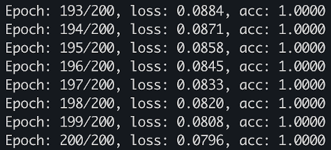

# GoBot
Neural network for intent classification built from scratch in Golang.

## Model Architecture
It is a 2-layer neural network (hidden and output), it uses **ReLU** for hidden layer activation and **Softmax** in the output layer which return the probabilities for each intent category.

Text inputs are preprocessed removing non letter characters, removing diacritics, converting to lower case and finally encoding as one hot vectors. Spell correction is made using levenshtein distance.

The optimization process is made with the **Adam** algorithm.

## How to Train
To train the model put the train data in the folder named `data`. The model params will be saved in `output` folder.

```
$ ./train.sh
```

Results with the example data



## Run Example
To run a web application demo using the model.

```
$ ./run.sh
```

The bot responses mapping intent categories are stored in `data/responses.json`.

